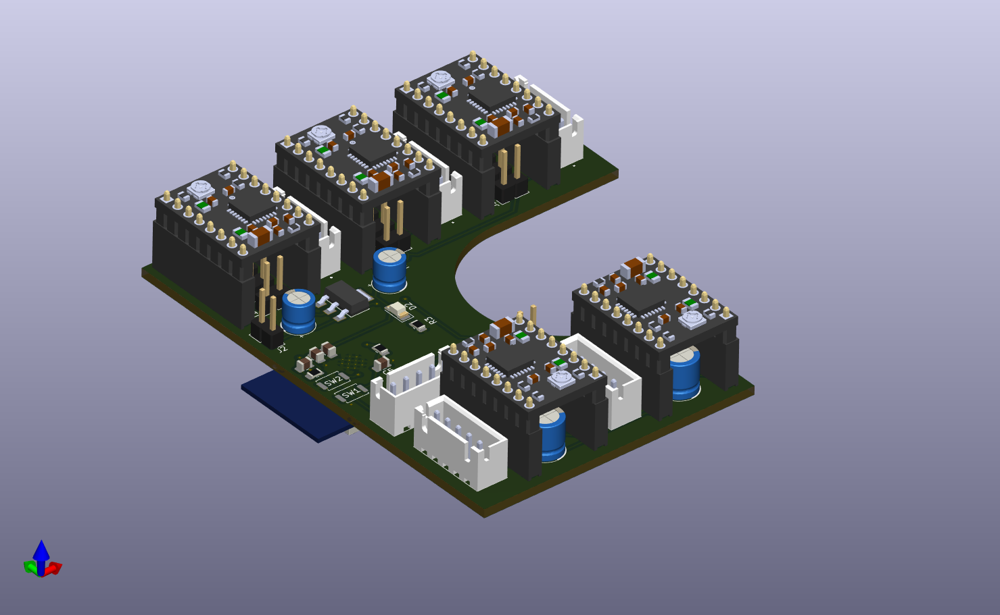
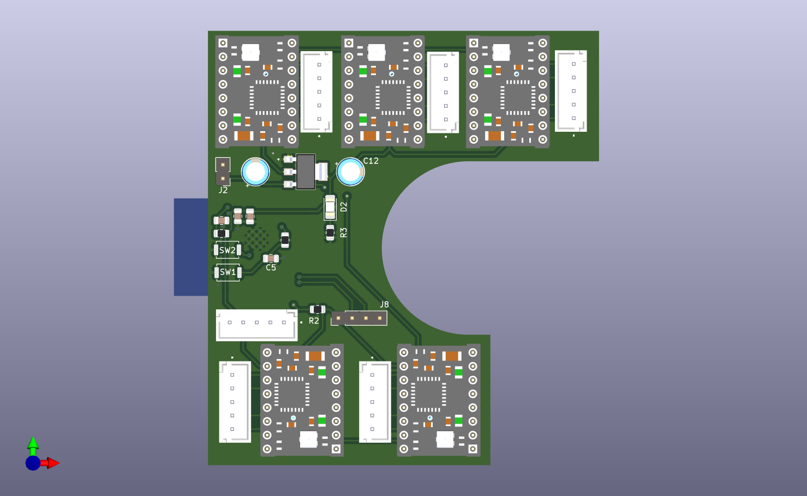
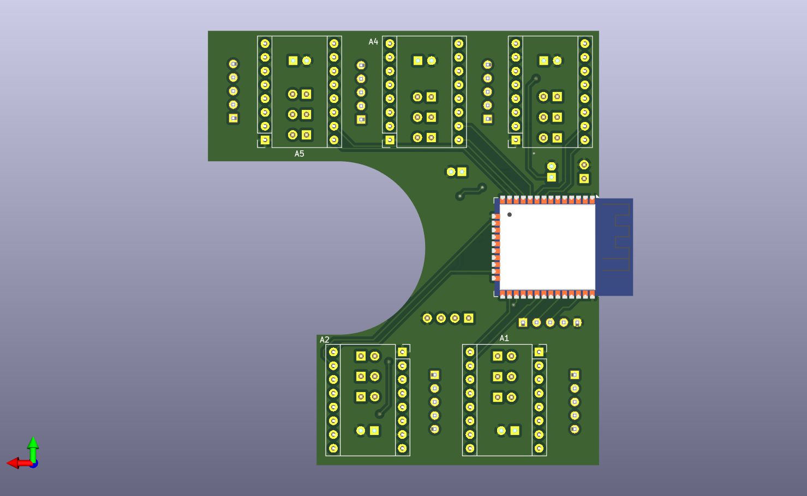

# RubiksCubeSolver
silly Rubik's Cube solver that will stand next to my desk and obsessively solve and scramble the cube, helping me procrastinate more by staring at it...

### PCB
2 layer board made with KiCad

### cube solving algorithms
> TODO

### BOM
> TODO
